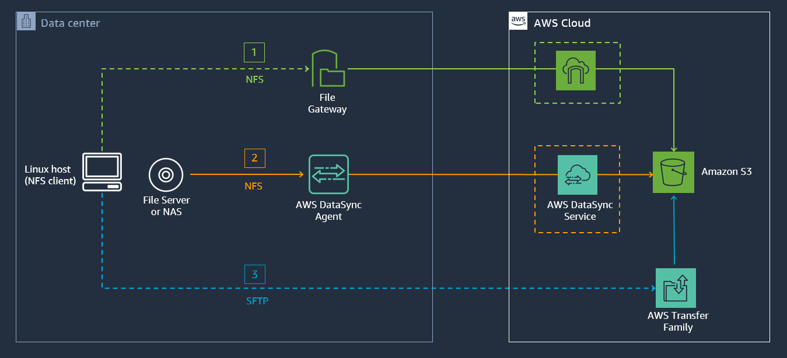

ONLINE DATA INGEST AND MIGRATION OPTIONS TO AMAZON S3 
=======================================================================

Copyright Amazon Web Services, Inc. and its affiliates.  All rights reserved. This sample code is made available under the MIT-0 license. See the LICENSE file.

Errors or corrections? Contact akbariw@amazon.com.

--------------------------------------------------------

OBJECTIVE OF WORKSHOP
--------------------------------

The prospect of moving data workloads to the cloud can be daunting, so can
trying to make sense of the array of tools, protocols, and mechanisms available
to move data into AWS.

In this workshop we will look at simple & repeatable design patterns you can use to simplify your data migration journey into AWS. You will get hands-on experience in deploying, configuring and
transferring data at scale using some of the available AWS online & hybrid data transfer services. 

In this lab we have a scenario where you will copy 10,000 small files to Amazon S3,
using different methods such as AWS S3 copy command script, AWS File Gateway, and also
AWS DataSync. Then visualize the benefits that AWS DataSync can provide in not only being able to simplify and accelerate the data transfer, but being able to preserve file metadata for transferred data from your NFS share. You will also learn how you can seamlessly access data your transferred data which is stored in Amazon S3 as objects, back in your environment using standard file shares. Lastly you will get hands on experience with AWS Transfer for SFTP and using it as a transfer mechanism.

The image below illustrates at a high level the different 3 AWS Services that we will use to get the workshop data, into Amazon S3 in a simple, repeatable and efficient manner.

 

  

**PREREQUISITES** 
--------------------------------

**AWS Account** – You will need an AWS account to log into to run this workshop, which has access to 
create AWS IAM roles, Amazon EC2 instances, Amazon S3 buckets, AWS DataSync, AWS Storage Gateway, AWS Transfer for SFTP and CloudFormation stacks in the AWS regions you select.

**Browser** – It is recommended that you use the latest version of Chrome or
Firefox for this workshop.

**Remote Desktop Client** - You will need a RDP client to logon to the Windows
EC2 instance (Windows RDP)

**Key Pair** – You will need a valid EC2 Key Pair in the AWS region you choose
for your workshop (US-WEST-2 Oregon). Instructions are provided in this workshop
on generating and downloading an EC2 Key Pair.

  

**WORKSHOP MODULES**
--------------------

This workshop encompasses 5 hands-on workshop activity modules, and a final clean-up module

**Module 1** - DEPLOY WORKSHOP RESOURCES

**Module 2** - DEPLOY S3 FILE GATEWAY (AWS STORAGE GATEWAY)

**Module 3** - DEPLOY AWS TRANSFER FOR SFTP

**Module 4** - DEPLOY AMAZON KINESIS DATA FIREHOSE

**Module 5** - DEPLOY AWS DATASYNC

**Module 6** - CLEAN-UP WORKSHOP RESOURCES

 

**Click** [here to get started with the first module to DEPLOY WORKSHOP RESOURCES](/module1/README.md)
