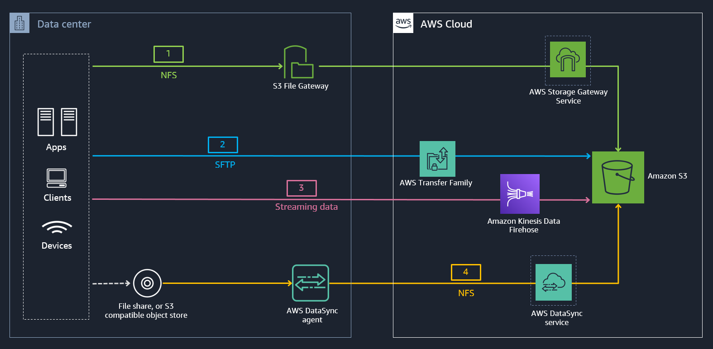

ONLINE DATA INGEST AND TRANSFER OPTIONS TO AMAZON S3 
=======================================================================

Copyright Amazon Web Services, Inc. and its affiliates.  All rights reserved. This sample code is made available under the MIT-0 license. See the LICENSE file.

Errors or corrections? Contact akbariw@amazon.com.

--------------------------------------------------------

OBJECTIVE OF WORKSHOP
--------------------------------

The prospect of ingesting or moving data to the cloud can seem daunting, so can
trying to make sense of the array of tools, protocols, and mechanisms available
to ingest or transfer data into AWS, whether your building a data lake, migrating application data or simply archiving data. In this workshop we will look at simple & repeatable design patterns you can use to simplify your data ingest and migration journey into AWS. You will get hands-on experience in deploying, configuring and transferring data using some of the available AWS online & hybrid data transfer services. 

In this lab we cover different scenarios such as:

   -   **Ingesting streaming data to Amazon S3**:  You will ingest streaming app data into an Amazon S3 bucket using Amazon Kinesis Data Firehose
    
   -   **Ingesting unstructured file data into Amazon S3 using traditional file shares**: You will ingest 10,000 files into an S3 bucket,using different methods such as a S3 copy script, S3 File Gateway, and also AWS DataSync and see the difference between each approach from a performance perspective. You will also see how S3 File Gateway and AWS DataSync can also preserve file metadata for the file data they transfer to an S3 bucket. 
   
   -    **Ingesting data using the SFTP protocol into Amazon S3**: You will deploy and use AWS Transfer for SFTP to ingest and access data in an S3 bucket using the SFTP protocol. You will also learn how you can seamlessly access and share data stored in your S3 bucket using file shares, through the S3 File Gateway. 
    
The outcome of this workshop is to help you visualize the benefits that each of the AWS service can provide to simplify and accelerate your data ingest and data transfer journey. 
    
 
The image below illustrates at a high level, the 4 different AWS Services that you will use to get the workshop data, using different protocols and data sources, into a common Amazon S3 bucket, in a simple, repeatable and efficient manner.

 

  

**PREREQUISITES** 
--------------------------------

**AWS Account** – You will need an AWS account to log into to run this workshop, which has access to 
create AWS IAM roles, Amazon EC2 instances, Amazon S3 buckets, AWS DataSync, AWS Storage Gateway, AWS Transfer for SFTP and CloudFormation stacks in the AWS regions you select.

**Browser** – It is recommended that you use the latest version of Chrome or
Firefox for this workshop.

**Remote Desktop Client** - You will need a RDP client to logon to the Windows
EC2 instance (Windows RDP)

  

**WORKSHOP MODULES**
--------------------

This lab workshop encompasses hands-on modules which NEED TO COMPLETED AS PER THE ORDER below, and a final clean-up module

**Module 1** - DEPLOY WORKSHOP RESOURCES

**Module 2** - DEPLOY S3 FILE GATEWAY (AWS STORAGE GATEWAY) - UNSTRUCTURD FILE DATA TRANSFER

**Module 3** - DEPLOY AWS TRANSFER FOR SFTP - FILE PROTOCOL DATA TRANSFER

**Module 4** - DEPLOY AMAZON KINESIS DATA FIREHOSE - STREAMING DATA TRANSER

**Module 5** - DEPLOY AWS DATASYNC - BULK DATA TRANSFER

**Module 6** - CLEAN-UP WORKSHOP RESOURCES

 

CLICK [here to START the AWS Sponsored workshop](/aws-sponsored/README.md)
-------------------

 

CLICK [here to START the On-Demand workshop](/on-demand/README.md)
-------------------
