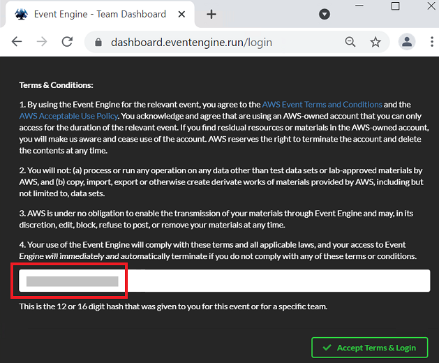

AWS SPONSORED - DEPLOY WORKSHOP RESOURCES MODULE
================================
Copyright Amazon Web Services, Inc. and its affiliates. All rights reserved.This sample code is made available under the MIT-0 license. See the LICENSE file.

Errors or corrections? Contact akbariw@amazon.com.

-------------------------------------------------------------

  
**OBJECTIVE**
----------------

In this module you will deploy the below workshop resources into the **US-WEST-2 (Oregon)** region:

-   1 x Windows instance (used as the lab access machine for the entire workshop)

-   1 x Linux Instance (used to perform the data transfers)
  

**LOG INTO AWS CONSOLE**
------------------------

1.  From your local workstation, open a web browser to the lab access URL provided for the workshop
    -   Click on the **Launch** button

    -   Click on the **Click here to access** link

    -   You will be taken to the Event Engine screen. **Important**- copy down down the **Event Engine Hash** value shown (red box) into a notepad file (this is only shown once). You will need this hash value to access your temporary AWS account during the  workshop. 

    

    -   Once you have copied the has value, click on **Accept Terms & Login**

    -   Click on **Email One-Time Password**

    -   You will then be takent o the Event Engine Team dashboard

    -   Copy down the **Event Engine URL** shown in the web browswer (i.e. https://dashboard.eventengine.run/dashboard). You will use this URL and the hash value you copied down to access your temporary AWS Account and AWS console during the entire lab. 

    -   Now that you have taken note of the items you need to access your temporary account, lets start the workshop

    -   Click on **AWS Console**

    -   Click **Open AWS Console**
    

  

**DEPLOY WORKSHOP RESOURCES**
-----------------------------

**Note:** Make sure your region is set to **us-west-2 (Oregon)**

1.  From the AWS console on your local laptop/workstation,
    from the services search bar, type & select **CloudFormation**

    -   Click on **Create stack**

    -   Click on **With new resources** from the drop down

    -   Under Amazon S3 URL enter this address  
        <https://ee-assets-prod-us-east-1.s3.amazonaws.com/modules/2343f58921ff4b66b136904c1265d64b/v1/part-2-deploy-resources.json>

    -   Click on **Next** at the bottom of the window

2.  Enter the **Stack name** of **STG316-Resources**

3.  Select the following for the other values

    -   **VPC** : Select option that has **STG316** in the name

    -   **subnet** : Select option that has **STG316 Public Subnet-AZ1** in the
        name

    -   **KeyName** : Select the key pair shown (i.e ee-default-keypair)

    -   **SecurityGroupIds**: Select **STG316-BastionHostSG**

    -   Do not modify the two values for **LatestWindowsAmiID &
        LatestLinuxAmiID**

4.  Click on **Next** to continue

    

5.  Scroll to the bottom of the next screen and click on **Next**

6.  Scroll to the bottom of the next screen, check the **CloudFormation
    acknowledgement** box and click on **Create stack**

-  You will be taken to the CloudFormation stack status page

-  Click on the **refresh** icon as
    until the status value changes
    to **CREATE_COMPLETE** (this may take a few minutes) as shown below,
    you can then progress to the next steps

  

**CONNECT TO YOUR INSTANCE**
----------------------------

**Firstly let’s retrieve the Windows administrator password from AWS Secrets
Manager**

1.  From **your workstation** navigate to your AWS console session, from the top search bar in the AWS console, type and 
    & select **Secrets Manager**

2.  Click on the value shown under **Secret name** (i.e. AdminSecret-abczxy)

3.  Scroll down the page and click on **Retrieve secret value**

4.  Copy and paste the password value shown for **Secret key value** into a notepad file

5.  Next let’s connect to your Windows Server EC2 instance

6.  From the AWS console and top search bar, type and & select **EC2**

7. From the left hand menu, select **Instances**

    -   In the right hand pane, select the box next to “**Workshop Windows
        instance 1**”, then right click and select **Connect**

    -   Click on The RDP Client tab, then **Download Remote Desktop File**

    -   Open the downloaded Remote Desktop File and select Connect at the prompt

    -   Enter the credentials below and click on OK

        -   username : Administrator

        -   Password : the value you obtained from Secrets manager

7.  When you have successfully logged into your Windows EC2 instance via the
    Remote Desktop Session, navigate back to your local workstation/laptop to
    where you stored the **\*.pem** key file earlier. **Right click** &
    select **copy** on the **\*.pem** file, and then go into your Remote Desktop
    Session (Windows EC2 instance) and **right click** on a free space on the
    **Desktop screen** and select **paste** to copy the **\*.pem** key file across.

  

 **Note:** All remaining tasks for the workshop will be performed through the
**Remote Desktop Session to the Windows EC2 Instance you just connected to in
the previous steps**.
----------------

  

9.  Open the Chrome browswer icon located on the desktop of the **Windows EC2 instance**, then paste the **Event Engine URL** you noted down earlier (i.e. https://dashboard.eventengine.run/dashboard), then enter the **Event Engine Hash** vale in the field provided. This will now log you into your temporary AWS account within the Windows EC2 instance, which you will use for the remainder of the lab. 
    

    -   Click on **AWS Console**, then click on **SSH Key**, next click **Download Key**, finally click **OK**. You will need this SSH key during the lab

    -   It will then download a ".pem" file to your users downloads folder, the downloaded file will also be shown at the bottom of the  Chrome screen for reference.

    -   From your screen click on **Open Console**. 

    -   From the AWS Console which you are now logged into, in the top services search bar, type & select **EC2**        
        
        
    -   Click on **SSH Key**, then click **Download Key**, then click **OK**. You will need this SSH key during the lab

    -   It will then download a ".pem" file to your users downloads folder (or a location you have specified). If you are using Google Chrome, the downloaded file will also be shown at the bottom of the screen for reference.

    -   From the top right hand drop-down ensure your region is **us-west-2
        (Oregon)**  

    -   From the left hand menu, select **Instances**

    -   In the right hand pane, select the box next to “**Workshop Linux
        instance 1**”.

    -   From the bottom window, select the **Details** tab, and write down
        the **private IP** address into the **workshop.txt** located on the desktop file where it
        states **Linux-Instance-Private-IP=**

    -   You will use this **Linux-Instance-Private-IP** in the next module
    
        

  

**SUMMARY**
-----------

In this module you deployed your base VPC, subnets, security groups, Amazon
EC2 compute instances and the SSH key that that you will use for the remainder of
the workshop. 

 

**END OF MODULE - DEPLOY WORKSHOP RESOURCES**
-------------------

 

CLICK [here to go to the S3 FILE GATEWAY module](/filegateway/README.md)
-------------------

