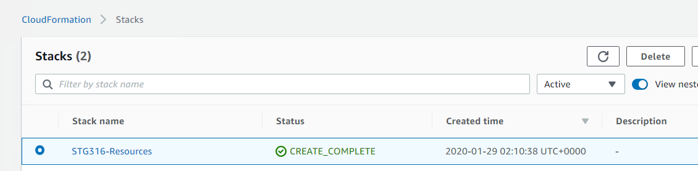

CLEAN UP WORKSHOP
=================
Copyright Amazon Web Services, Inc. and its affiliates. All rights reserved.This sample code is made available under the MIT-0 license. See the LICENSE file.

Errors or corrections? Contact akbariw@amazon.com.

---------------------------------------------------------------------------------

**Note**: You will need to perform all the cleanup workshop from a browser
session from **YOUR LAPTOP/WORKSTATION** and not from the Remote Desktop
Session.

**DELETE THE AWS TRANSFER FOR SFTP INSTANCE YOU CREATED**
-----------------------------------------

1.  Navigate to the AWS console, at the top of the screen,
    click **Services** and type & select **AWS Transfer for SFTP**

2.  Select the Server-ID you created for the this workshop

3.  From the top menu select **Actions** and then **Delete**

4.  Type "delete" in the prompt field and click on **Delete**

5.  Navigate to the AWS console, at the top of the screen,
    click **Services** and type & select **IAM**

6.  .

  

**DELETE THE TWO AMAZON S3 BUCKETS YOU CREATED**
-----------------------------------------

1.  Navigate to the AWS console, at the top of the screen,
    click **Services** and type & select **S3**

2.  Locate the bucket you created for **Source-S3-Bucket & Target-S3-Bucket**

3.  Click on the check box next to the name

4.  Select Delete from the top options

5.  Follow the prompts

6.  Repeat step 2-5 for **Target-S3-Bucket**

  

**DELETE AWS FILE GATEWAY NFS SHARES & GATEWAY**
--------------------------------------------

1.  Navigate to the AWS console, at the top of the screen,
    click **Services** and type & select **Storage Gateway**

2.  From the left hand menu select **File shares**

3.  Select the two NFS shares you created (check the box next to them)

4.  **Click on Actions Delete File share**

5.  Confirm deletion of resources and select **Delete**

6.  From the left hand menu select **Gateways**

7.  Select the File Gateway you deployed (STG316-filegateway)

8.  Click on **Actions Delete gateway**

9.  Confirm deletion of resources and select **Delete**

  

**DELETE AWS DATASYNC**
-----------------------

1.  Navigate to the AWS console, at the top of the screen,
    click **Services** and type & select **DataSync**

2.  From the left hand menu select **Tasks**

3.  Select the task you created

4.  Click on **Actions Delete** File share

5.  Confirm deletion of resources and select **Delete**

6.  From the left hand menu select **Locations**

7.  Select the two locations relating to your configuration

8.  Click on **Delete**

9.  Confirm deletion of resources and select **Delete**

10. From the left hand menu select **Agents**

11. Select the agent you deployed

12. Click on **Delete**

  

**DELETE AMAZON EC2 RESOURCES DEPLOYED OUTSIDE OF CLOUDFORMATION**
-----------------------------------------------------------

1.  Navigate to the AWS console, at the top of the screen,
    click **Services** and type & select **EC2**

2.  From the left hand menu select **STG316-FileGateway & STG316-DataSync**

3.  Click on **Actions Instance state Terminate**

4.  Confirm deletion of resources and select **Delete**

5.  From the left hand window pane select **Volumes**

6.  Click on the **refresh** button on the top right hand corner until your
    **150GB io1** volume is showing its state as **available.**

7.  Verify that the **Attachment information** is blank for this volume (not
    attached to any host)  
    

8.  Select your **150GB io1** volume and click **on Actions Delete Volume**

9.  Confirm deletion of resources and select **Delete**

  

**DELETE CLOUDFORMATION STACK – STG316-RESOURCES**
--------------------------------------------------

1.  Navigate to the AWS console, at the top of the screen,
    click **Services** and type & select **CLOUDFORMATION**

2.  Select the **STG316-Resources** stack you deployed

3.  Click on **Delete**

4.  Confirm deletion of resources and select **Delete stack**

5.  Click on the refresh icon until the stack disappears from the list

6.  Next click on the dropdown and change it from Active to Deleted

7.  Verify **STG316-Resources** shows a status of **DELETE_COMPLETE**

8.  Next click on the dropdown and change it from Deleted to Active

9.  From the same Cloudformation window select the **STG316-VPC** stack

10. Repeat steps 3-7

**CLEANUP TASKS COMPLETED**
----------------------------
