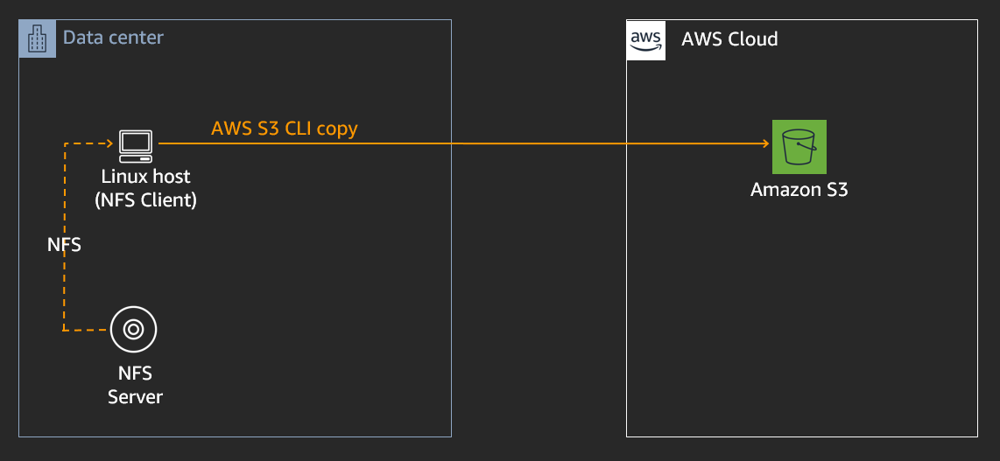
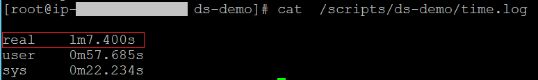
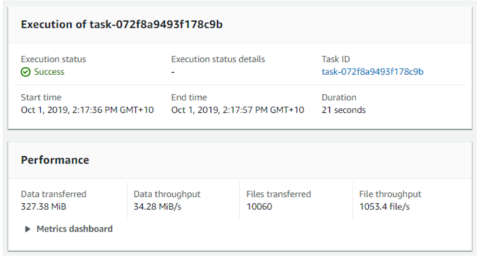
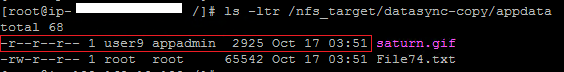

AWS DATASYNC MODULE- BULK DATA TRANSFER 
========================================
Copyright Amazon Web Services, Inc. and its affiliates. All rights reserved.This sample code is made available under the MIT-0 license. See the LICENSE file.

Errors or corrections? Contact akbariw@amazon.com.

-------------------------------------------------------------------------------------
**INTRODUCTION**
-------------------
AWS DataSync is a data transfer service that makes it easy for you to simplify,
automate & accelerate data transfer between on-premises storage and Amazon S3, Amazon Elastic File System, or Amazon FSx for Windows File server. AWS DataSync automatically handles many of the heavy lifting tasks related to data transfers that can slow down and complicate migrations such as building & managing complex scripts that handle metadata preservation, data integrity validation, enabling parallel transfers and network optimization.

  

**OVERVIEW**
-------------------
In this module you will transfer approx. 10,000 small files from
an NFS share (**/nfs_source)** to an Amazon S3 bucket using two methods

-   **Method 1 –** Utilize a script which uses the AWS S3 cp command to pull the
    data from an NFS share and push it to an Amazon S3 bucket. We will perform this to get a
    baseline for transfer performance and understand what metadata is copied
    across using this method.

-   **Method 2 -** Deploy and configure a single AWS DataSync agent task to
    accelerate the data transfer bypassing reading the data directly from the NFS server and writing it to an Amazon S3 bucket.
    We will then compare the performance & metadata of both methods.

  

**METHOD 1 - 10,000K SMALL FILE MIGRATION USING A SCRIPT**
------------------------------------------------------
 

Now lets migrate 10,000 small files (hosted on the NFS server), using a copy script located on the Linux host EC2 instance. The copy script will read from the NFS mount point and write to Amazon S3.

 

1.  Navigate back to the SSH session you have running to your Linux  EC2 instance (NFS client)

2.  In the SSH session run the below commands to upate the copy script with your
    values as per the instructions shown below

			cd /scripts/ds-demo

			vi copy_script.sh

- Press “**i**” to go into edit mode

- Update the **< Target-S3-Bucket >** in the script with
            the **Target-S3-Bucket** name you created in the previous steps

- Press the “**ESC**” button when you are done editing

- Type ”:**wq**” and hit **Enter** to save changes and exit

3.  Now let’s open a second SSH session using the below steps (which we will use
    to monitor the network performance), leave this session open

    -   In your remote desktop session, click on Windows icon located at the
        bottom left of the screen

    -   Type **CMD** and hit Enter to open a new command prompt

    -   You should have stored your ***.pem** key file on the desktop as per the
        previous instructions. 

	- Enter the below commands in the command prompt

			cd c:\users\administrator\desktop

    -  Next enter the below command to SSH into the Linux server, remember to replace the two values shown in **< >** with your values (*i.e. ssh –i stg316-key.pem ec2-user@192.168.10.102*)

			ssh -i <your-key-file-name>.pem ec2-user@<Linux-Instance-Private-IP>  

    - Switch back to your **first** SSH session and run the below commands to start
    the script to copy data from **/nfs_source** to your **Target-S3-Bucket**

			sudo su
			
			cd /scripts/ds-demo

			./start-transfer.sh

    - Switch to your **second** Putty SSH session which you just opened and run the
    following command to observe the copy transfer performance

			sudo su

			cd /scripts/ds-demo

			./show_performance.sh
  

**Note** the throughput values shown (i.e. x MB/s transfer rate) for the first 30 seconds, then switch back to your first SSH session window

- Navigate back to the first SSH session and wait until the output states “**Data transfer to Amazon S3 bucket complete”**

- From within your first SSH session run the following commands

			cat /scripts/ds-demo/time.log

**Take note** of the time the script took to run (it is the time value shown next to the value for **real**)

  

**METHOD 2 - 10K SMALL FILE MIGRATION USING AWS DATASYNC**
----------------------------------------------------------

 

Now lets migrate the same 10,000 small files (hosted on the NFS server), this time using AWS DataSync.

 

  

**DEPLOY AWS DATASYNC AGENT**
-----------------------------

We are going to deploy the AWS DataSync agent within AWS as an EC2 instance in
the absence of an on-premise environment (where you could deploy it as a VMware
appliance). The AWS DataSync agent will then read directly from the NFS server
(not the NFS client) and transfer the data to your **Target-S3-Bucket**

1.  Using the Chrome icon on the Windows EC2 instance desktop, log into your AWS Account using Chrome and perform the following tasks to update the IAM role we are using for the Windows server EC2 instance

    -   Using a Chrome session log into the AWS console. From the top search bar of the AWS console, type and select **IAM**
    -   Select **Roles** from the left hand pane
    -   In the search field enter **WindowsInstanceRole**, and click on the name that it returns
    -   In the Permissions tab on the next screen, click on the **Attach policies** blue button
    -   In the search field enter **AmazonSSMReadOnlyAccess**
    -   Check the box next to the returned policy name to select it
    -   Click on **Attach Policy**

2.  From the Chrome session navigate to the AWS console. From the top search bar of the AWS console, type and selec **DataSync**

    -   Select **Get Started**

    -   In the Deploy agent page hypervisor dropdown menu, select **Amazon EC2** section click on
        the **Learn more**  icon

	-   Take note of the instructions for deploying the DataSync agent as an EC2 instance, which i have summarized for you with the follow steps. 
	-   Open a Windows Command Promt (CMD) on your Windows server instance. Copy and paste the below command into the command prompot, and run it (note we are using the us-west-2 region in our lab). It will return the value of the ami-id we need to use for our EC2 instance for the DataSync agent.

	`aws ssm get-parameter --name /aws/service/datasync/ami --region us-west-2`

	- From the output of the above command copy the "ami" value shown for the item of **"Value"** into your workpad file as ami-id to use  in the next step (e.g. ami-0b703a238b1fc4df5)
	
	**Note** : If you are unfamiliar with the region name syntax, you can use this command to list out the RegionName's (aws ec2 describe-regions --output table)

	- Next copy and paste the below command into your workshop notepad file and replace **ami-id** with the value you noted from above. Then copy and paste that whole URL into a new tab in your Chrome Internet browser. 
	
	`https://console.aws.amazon.com/ec2/v2/home?region=us-west-2#LaunchInstanceWizard:ami=ami-id`
	
	`e.g. https://console.aws.amazon.com/ec2/v2/home?region=us-west-2#LaunchInstanceWizard:ami=ami-0b703a238b1fc4df5`

	This will now select the AMI image that we cna use for the DataSync agent.
	

    -   Ok, now lets go ahead and configure our EC2 instance that we will use for our DataSync agent

        -   In the next page, select the box next to **r5.xlarge**

        -   Select **Next: Configure Instance Details**

        -   In the **Network** drop down select the VPC which has “**STG316**”
            in its name

        -   In the **Subnet** drop down, select the one which has “**STG316**”
            in its name

        -   Leave all other settings as default on the page

        -   Click **Next: Add Storage**

        -   Click **Next: Add Tags**

            -   Select **Add Tag**

        -   Enter the following values (case sensitive)

            -   Key = **Name**

            -   Value = **STG316-DataSync**

        -   Click **Next: Configure Security Group**

            -   Click on the “**Select an existing security group**” check box

            -   Select the security group with the name
                of **STG316-FileGatewaySG**

        -   Click **Review and Launch**

        -   Click **Launch**

        -   Select your **key pair** , accept the check box and click **Launch
            Instances**  
            

    -   From the AWS console and its search bar, type & select **EC2**

        -   From the left hand menu, select **Instances**

        -   In the right hand pane, select the box next to “**STG316-DataSync**”

        -   From the bottom window pane, select the **Details** tab, and
            copy the **private IP** address that is shown, into your workshop.txt file
            for **DataSync-Instance-Private-IP**

            -   Ensure the “**Status Check**” column for this EC2 instance
                shows **“2/2 checks passed“** before proceeding to the next
                step.

        -   From the AWS console using its search bar at the top of the screen,
            type & select **DataSync**

            -   Select **Get Started**

            -   Enter the following values on the page

                -   **Deploy agent** type: Amazon EC2

                -   **Service endpoint:** Public service endpoints in US
                    West (Oregon)

                -   **Activation key:** Select **Automatically get the activiation key**, then enter the Private IP address you copied
                    in the previous step for **DataSync-Instance-Private-IP** into the http:// field.

                -   Select **Get Key**

                    -   You will get the following successful output after your
                        agent has activated successfully

                -   Select **Create Agent** to continue

		

	-   When the create agent process is complete click on the **blue DataSync** hyperlink at the top left of the screen to continue with the next step of
  	  creating a task

	

  

**TRANSFER DATA USING DATASYNC** 
---------------------------------

1.  Expand the right hand menu, click on **Tasks**, then click on the **Create task** in the right hand side of the window

    -   Select **Create a new location** from the source locations options

    -   **Location type:** Network File System (NFS)

    -   **Agents:** select the agent you have just deployed

    -   **NFS Server:** enter the value of
        your **File-Gateway-Instance-Private-IP**

    -   **Mount path:**  enter your **Source-S3-Bucket** name value

    -   Click **Next** to continue

2.  Select **Create a new location** from the Destination locations options

    -   **Location type:** Amazon S3 bucket

    -   **S3 bucket:** **Target-S3-Bucket**

    -   **S3 storage class:**  Standard

    -   **Folder:** Enter in this value “**datasync-copy**“

    -   **IAM role:**: click on the **Autogenerate** button

    -   Click **Next** to continue

3.  Provide a task name (*i.e. NFS-to-S3-transfer-10K-small-files*)

    -   **Verify data:** Check integrity during transfer

    -   **Copy file metadata:** Ensure the following items are all checked

    -   **Task logging**: Do not send logs to CloudWatch

    -   Leave all other options as such as default & select **Next**

    -   Click **Create task**

4.  On the next screen wait until the **Task status** value is **Available**
    (refresh screen to get update)

5.  Click on the **Start** button

6.   Select Start with defaults

7.  At the top of the screen click on the **See execution details** button to
    view the progress of the transfer

8.  The task will go through a few phases, where it will first compare the files
    in the source location with what’s stored on the target before sending the new or updated files. In this lab there
    are approx 10,000 files to be transferred so the launching phase may take a
    moment before switching to the transferring state.

    -   While it is going through these states, navigate through the
        performance, locations, options, filters and task logging tabs in the
        middle of the screen to verify the parameters you have configured and
        the view the outputs available

9.  When the **Execution status** show a status of **Success**, your data
    transfer has completed.

    -   Take note of the **Duration** time (shown in seconds) taken for the data transfer, and also
        of the **Data throughput** values, how do they compare with the values
        you achieved using the S3 copy script in the previous section?

  

**VERIFY DATA TRANSFERRED USING BOTH METHODS**
----------------------------------------------

Lets view the data copied across from the local NFS share to our target Amazon S3 bucket

1.  From the AWS console, using the search bar type &
    select **S3**

-   Click your **Target-S3-bucket** name

    -   Check the box next to the folder labelled **s3-cli-copy**

        -   Click on **Actions**→ **Calculate total size**

        -   Note the total objects copied to your S3 bucket via the S3 copy
            script

        -   Click **Close** when done viewing.

    -   Check the box next to the folder labelled **datasync-copy**

        -   Click on **Actions**→ ***Calculate total size**

        -   Note the total objects copied to your S3 bucket via DataSync

        -   Click **Close** when done viewing.

-   Click on the folder name **datasync-copy** to go into the directory/prefix

    -   Click on **Appdata**

    -   Click on the **saturn.gif** file

    -   In the next windo, scroll to the section on **Metadata**

    -   This will show you the metadata that DataSync added to object that it
        copied across to S3, if you look closely you will see it is storing the file permissions, timestamp and ownership details as metadata. In the next section we view the value of this
        metadata to help avoid re-factoring applications that access files based
        on user/group permissions.

  

**COMPARE METADATA BETWEEN DATA COPIED BY SCRIPT VS DATASYNC**  
------------------------------------------------

 

  

**COMPARE TRANSFER METHODS: SCRIPT VS DATASYNC**

Now let’s view the files that the S3 copy script & DataSync agent copied across to your target Amazon S3 bucket. We have already mapped a File Gateway, file share to your target S3 bucket, usign the /nfs_target mount point.
So lets use that file share access to our S3 data to see how the metadata translates to the stored
files, and what attributes were preserved by the s3 copy script and DataSync.

1.  From the AWS console, in the top search bar, type
    & select **Storage Gateway**

    -   From the left hand pane select **File shares**

    -   Check the box next to the file share ID which shows
        your **Target-S3-Bucket** name in the S3 location column

    -   From the top menu select **Action**→ **Refresh Cache** then
        select **Start**

2.   **View original data**- Run the below command in your SSH session
        to view the original data time stamp & permissions for the
        file **saturn.gif** located on /nfs_source

			ls -ltr /nfs_source/appdata

3.    **View S3 copy script data that was transferred** - Run the below
        command to view the time-stamp, user/group & permission attributes for
        the file **saturn.gif** copied via the S3 CLI copy script.

			ls -ltr /nfs_target/s3-cli-copy/appdata

-   Do the time-stamps, user/group & permission value differ from the original data?

4.   **View DataSync copied data** - Run the below command to view the
        timestamp, user/group & permission value for the
        file **saturn.gif** copied via DataSync.

			ls -ltr /nfs_target/datasync-copy/appdata   

-   Do the time-stamps, user/group & permission value differ from the
        original data? Were they preserved?
  

**Note:** Notice how the Saturn.gif file that was copied across using DataSync
retained the same timestamp & permissions (r-r-r & user9:appadmin) as the
original source file, unlike the data copied across via the script.

  

**SUMMARY**
-----------

In module 3, you obtained hands-on experience in deploying and configuring AWS
DataSync to simplify, automate and accelerate the transfer of data, in this case
10,000 very small files to Amazon S3 compared to scripting it. AWS DataSync also
copied across the metadata (so you could re-access the same objects again via
File Gateway as files with their permissions & timestamps). AWS DataSync
encompassed data transfer verification, and didn’t require any scripting
knowledge or performance tuning to enable faster data transfers.

  

**END OF MODULE - AWS DATASYNC**
-------------------

CLICK [here to go to the CLEAN-UP module](/cleanup/README.md)
-------------------

