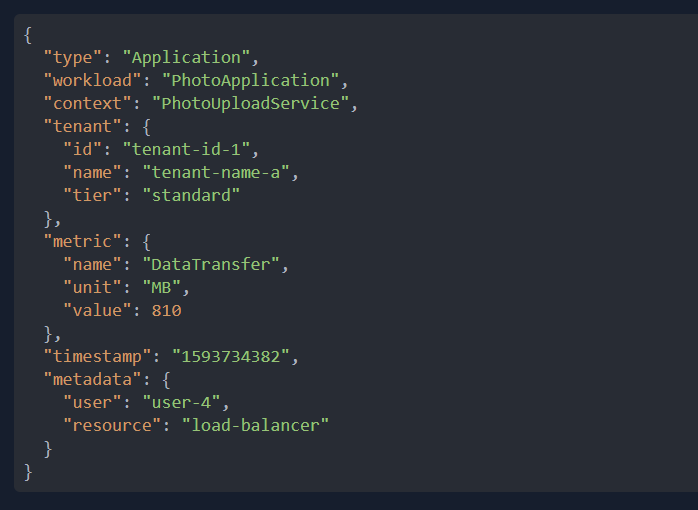
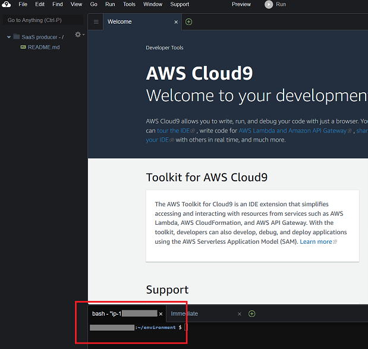

AMAZON KINESIS DATA FIREHOSE MODULE - STREAMING DATA
====================================================
Copyright Amazon Web Services, Inc. and its affiliates. All rights reserved.This sample code is made available under the MIT-0 license. See the LICENSE file.

Errors or corrections? Contact akbariw@amazon.com.

-------------------------------------------------------------------------------------
**OVERVIEW**
-------------------
In this module we will focus on how you can easily inject streaming data from an application into an Amazon S3 data lake, using Amazon Kinesis Data Firehose.
We will start by simulating a fictional SaaS application that is generating a stream of data containing telemetry information about tenants that use different features of the application. You could use different technologies to collect and inject data into an S3 data lake in real-time, in this scenario we will use Amazon Kinesis, which is a fully managed cloud-based service for streaming large, distributed data streams in real-time.

Amazon Kinesis allows you to not only track the stream of events that our fictional SaaS application produces via Kinesis Streams, but also enables you to easily consume those events and store the data in an S3 bucket using AWS Kinesis Data Firehose. With data stored in S3, you can then do more with your streamed data, such as query in-place or build ML models. Please note that if you do not need real-time analysis, your data could be sent directly to Kinesis Data Firehose, without the need of a Kinesis stream, which can help reduce costs.

  

**GENERATE DATA USING AMAZON KINESIS DATA STREAMS**
-------------------
In this section you will generate telemetry events from an imaginary SaaS application and track them using Kinesis Streams.

  

**LAUNCH A KINESIS DATA STREAM**
------------------------------------------------------
 

First, you will create an Amazon Kinesis Data Stream, consisting of a single shard, to capture the incoming data.

 

1.  Open your AWS Management Console

2.  From the Chrome session, in the AWS console, at the top of the screen from the AWS console search bar, type & select **Amazon Kinesis**

- On the following screen, click Create Data Stream

- As Data Stream name use **tenant-metrics-stream**, then choose 1 as mumber of shards. After that, select **Create** in the lower-right corner of the screen

- After a few moments verify that your Amazon Kinesis Data Stream is showing a status of ACTIVE

  

**USING AMAZON KINESIS DATA STREAMS**
----------------------------------------------------------

 

Now we will execute a Python application that simulates your SaaS application sending metrics to that stream. Before we generate some sample metrics, it is important to understand the exemplary structure of the multi-tenant JSON. An telemetry entry, generated by our script, might look like this:

 

The schema contains the following elements:

-  "**type**": This defaults to “Application” in our case. 
	
-   "**workload**":  A workload is a collection of resources and code that delivers business value, such as a customer-facing application or a backend process. This could be your SaaS application. In some cases, you might have multiple SaaS applications, and adding this attribute allows us to aggregate metrics from multiple applications into a single place.
	
-  "**context**": This is used to capture a feature inside your SaaS application. You might allow tenants to sign-up for multiple features based upon their tiers and want to capture the usage across these features.
	
-  "**tenant**": This is basically your fictional tenant information. 

- "**metric**": This is your actual metric information. As per the above image of the JSON, we have shown “DataTransfer” as an example. Our sample metric generator has few more examples, like “Storage” and “ExecutionTime”. It is up to the product owners and architects of the SaaS application to decide, what relevant metrics they want to capture to understand the tenant consumption patterns.
	
-  "**timestamp**": This denotes the time at which the metric was recorded.
	
-  "**metadata**": This could be used to send any other key-value pair data which can provide useful information about the tenant and/or metric.

	
	
  

**SIMULATE THE METRIC PRODUCER APPLICATION**
-----------------------------

To run the metric generator, we use Cloud9, which is an online development environment. 

1.  Using the Chrome session in your RDP session, navigate to the AWS console. At the top of the screen from the AWS console search bar, type & select **Cloud9**

    -   Click on **Create environment**
    -   Enter a name for instance SaaS producer and click **Next**
    -   Enter the below values for each input field  
    -   **Environment type**: Create a new EC2 instance
    -   **Instance type**: t3.small
    -   **Platform**: Amazon Linux 2
    -   **Cost-saving setting**: After 4 hours
    -   Click **Next**, and then **Create environment**
    -   It will take a few minutes for your environment to be provisioned.Once ready, your IDE will open a welcome screen. Below that, you should see a terminal prompt (red box shown) where you will copy and paste commands for this lab module. 	

Lets now generate some streaming data

2.  In the terminal  (bottom of IDE screen) execute the following commandos, to install the boto3 Python library, download the metric generator script and execute it.

			sudo pip3 install boto3

			wget https://data-expert-path.workshop.aws/code/application-metrics-generator.py
			
			python application-metrics-generator.py tenant-metrics-stream

3.  You should then see the data that is being sent to Kinesis. Keep the script running until the end of this lab in order to produce enough data. 

4.  In the AWS Management Console, return to Amazon Kinesis. 

5.  Select your stream under "Monitoring”, and observe the PUT metrics associated with your stream. It may take a few minutes for CloudWatch to show the new metrics.
    

  

**INJECT AND STORE KINESIS DATA STREAM DATA IN YOUR DATA LAKE** 
-----------------------------------------------------------------
In this section you will set up a Kinesis Firehose that will deliver your stream into a S3 bucket as part of your data lake.

1.  Navigate to the AWS Management Console, at the top of the screen from the AWS console search bar, type & select **Amazon Kinesis**

    -   From the left side menu, select **Delivery streams**, then click on **Create Delivery Streams**

    -   Update the page with the following values

    -   **Source**: Kinsesis Data Stream

    -   **Destination**: Amazon S3

    -   In the **Source Settings** section, click on **Browse**. Then select the Kinesis data stream name you created earlier (i.e. tenant-metrics-stream). The click on **Choose** 
	
	-   **Data Stream Name**: tenant_metrics_firehose
	
	-   Click **Next**
	
	-   **Transform source records with AWS Lambda**: Disabled

	-   **Convert record format**: disabled

	-   In the **Destination settings** section, for the **S3 bucket**, click on **Browse** and then select the name of the S3 bucket you created in module 2 of this workshop. Then click **Choose*
	
	-   **Dynamic partitioning**: disabled
	-   **S3 bucket prefix**: stream/   (Do not forget the / at the end of the prefix!)
	-   Click **Next**
	-   Expand the **Buffer hints** section and speciifiy the values: **Buffer size**: 1, and **Buffer interval**: 60
	-   **Compression for data records:* Gzip
	-   **Encryption for data records**: Disabled
	-   Expand **Advanced settings** and select the values listed below
	-   **Amazon CloudWatch error logging**: Enabled
	-   **Permissions**: Create or update IAM role (KinesisFireHoseServiceRole-tentant_metric-us-west-2-xyz)
	-   Click **Create delivery Stream** to finish
	-   After a few moments the status for the Delivery stream will show as ACTIVE
	
	
Congratulations! You are now ingesting your first events into your Amazon S3 based data lake! You have just deployed and configured Amazon Kinesis Data Streams and Kinesis Data Firehose, where Kinesis Data Firehose will read the streaming data being stored by the Kinesis Data Stream, and will deliver them into your S3 bucket, as files based on batches of either 1 MB or 60 seconds.
		
	

2.  Wait 5 minutes, then navigate back to the S3 console https://s3.console.aws.amazon.com/s3/home
 
    -   Click on your S3 bucket name

    -   After a few minutes (you may have to press the refresh button), you will see that in the S3 bucket, under the stream/ prefix folder,  USERNAME-tenant-metrics files are being created. If you take a look at the files in S3, you will see that these are json objects files compressed in .gz format containing the data from our generator script running in Cloud9.

    -   Outside of the scope of this workshop, with the data now stored in your S3 bucket, you could then query your stream of data in real-time

   

  

**END OF MODULE**
-------------------

CLICK [here to go to the AWS DATASYNC module](/datasync/README.md)
-------------------

