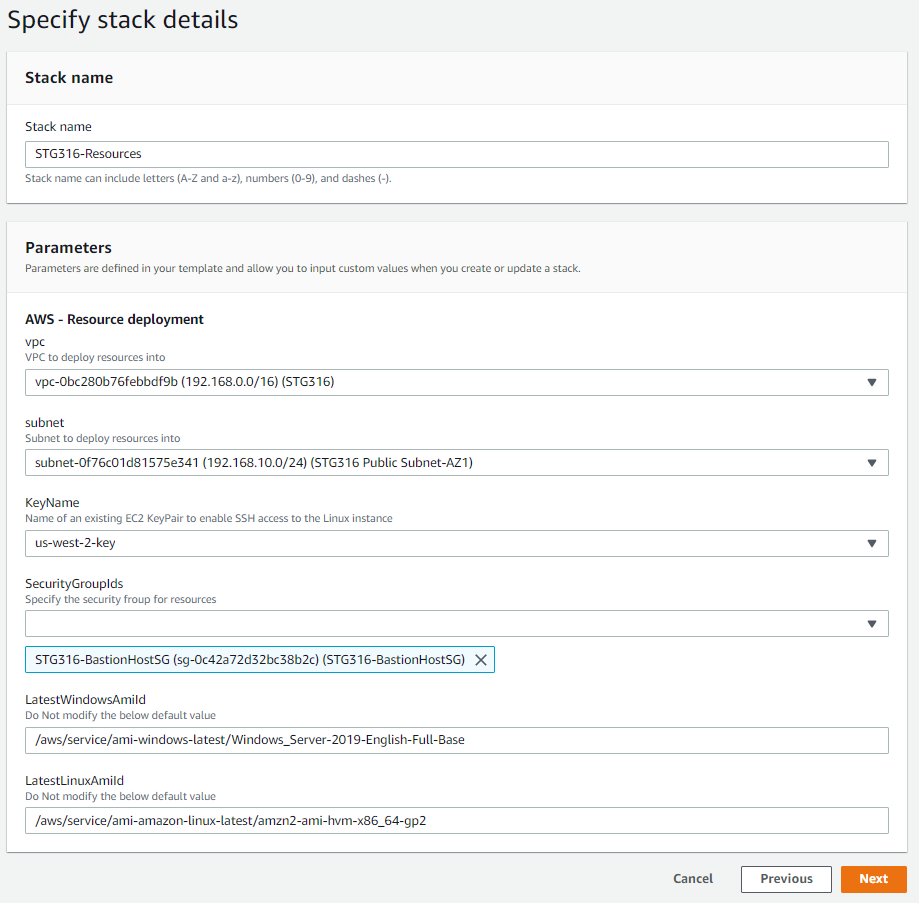
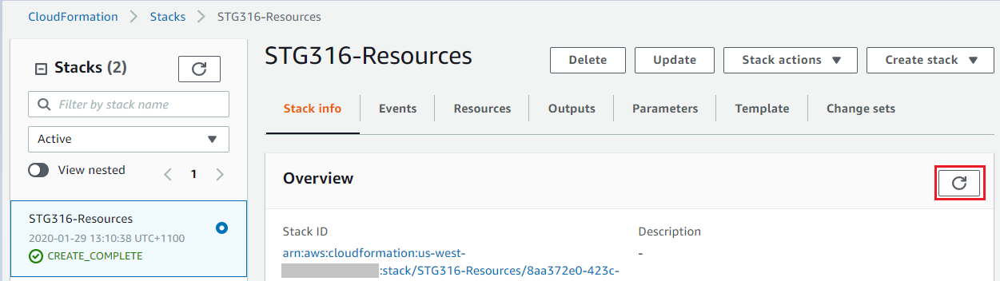

DEPLOY WORKSHOP RESOURCES
==========================
Copyright Amazon Web Services, Inc. and its affiliates. All rights reserved.This sample code is made available under the MIT-0 license. See the LICENSE file.

Errors or corrections? Contact akbariw@amazon.com.

-------------------------------------------------------------

  
**OBJECTIVE**
----------------

In this module you will firstly deploy the base AWS VPC network environment via
the first CloudFormation template, then using the second CloudFormation template
deploy the workshop resources into the **US-WEST-2 (Oregon)** region which
contains the following:

-   1 x Windows instance (used as the access machine for the workshop)

-   1 x Linux Instance (used to perform the data migrations)
  

**LOG INTO AWS CONSOLE**
------------------------

1.  From your local workstation, open a web browser to the AWS console and login with your AWS Account
    URL <https://console.aws.amazon.com>  

  
**CREATE KEY PAIR**
-------------------

1.  In the AWS Console window that you opened, in the top right hand corner,
    next to your account name, click on the drop down and change your region
    to **us-west-2 (Oregon)**

1.  From the top left of the screen click **Services** and type & select **EC2**

2.  From the left hand window pane, navigate to **Network & Security**, click on **Key Pairs** and from the right hand window
    select **Create Key Pairs** from the top menu

    -   Enter the Key pair name of : **stg316-key**

    -   Select **PEM** file format

    -   Select **Create**

3.  It will then download a **.pem** file to your users **downloads** folder (or
    a location you have specified). If you are using Google Chrome, the
    downloaded file will also be shown at the bottom of the screen for
    reference.

 

>   **Note:** Take note of the location of this **.pem** file you downloaded, as you will
copy this key to your deployed Amazon Windows EC2 instance, once you have deployed it as part of the subsequent instructions

  

**DEPLOY VPC ENVIRONMENT**
--------------------------

**Note:** Make sure you set your region to **us-west-2 (Oregon)**

1.  From the AWS console on your local laptop/workstation,
    click **Services** and type & select **CloudFormation**

2.  In the top right hand corner, next to your account name, click on the drop
    down and change your region to **us-west-2 (Oregon)**
    

    -  Now in the CloudFormation page click on **Create stack**

    -  Click on **With new resources** from the drop down

    -   Under Amazon S3 URL copy and paste this URL  
    <https://ee-assets-prod-us-east-1.s3.amazonaws.com/modules/2343f58921ff4b66b136904c1265d64b/v1/part-1-deploy-vpc.json>

    -   Click on **Next** at the bottom of the window

3.  Enter the **Stack name** of **STG316-VPC**

4.  Leave all other values as unchanged  
    
    

5.  Click on **Next** to continue

6.  On the next page scroll to the bottom and click on **Next** to continue

7.  Click on **Create stack**

8.  Click on the **refresh** icon as
    highlighted in **RED** until the status value changes
    to **CREATE_COMPLETE** (this may take a few minutes) as shown below, you can
    then progress to the next steps

  

**DEPLOY WORKSHOP RESOURCES**
-----------------------------

**Note:** Make sure your region is set to **us-west-2 (Oregon)**

1.  From the AWS console on your local laptop/workstation,
    click **Services** and type & select **CloudFormation**

    -   Click on **Create stack**

    -   Click on **With new resources** from the drop down

    -   Under Amazon S3 URL enter this address  
        <https://ee-assets-prod-us-east-1.s3.amazonaws.com/modules/2343f58921ff4b66b136904c1265d64b/v1/part-2-deploy-resources.json>

    -   Click on **Next** at the bottom of the window

2.  Enter the **Stack name** of **STG316-Resources**

3.  Select the following for the other values

    -   **VPC** : Select option that has **STG316** in the name

    -   **subnet** : Select option that has **STG316 Public Subnet-AZ1** in the
        name

    -   **KeyName** : Select the key pair name you created in the previous step (**stg316-key**)

    -   **SecurityGroupIds**: Select **STG316-BastionHostSG**

    -   Do not modify the two values for **LatestWindowsAmiID &
        LatestLinuxAmiID**

4.  Click on **Next** to continue

    

5.  Scroll to the bottom of the next screen and click on **Next**

6.  Scroll to the bottom of the next screen, check the **CloudFormation
    acknowledgement** box and click on **Create stack**

-  You will be taken to the CloudFormation stack status page

-  Click on the **refresh** icon as
    highlighted in **RED** until the status value changes
    to **CREATE_COMPLETE** (this may take a few minutes) as shown below,
    you can then progress to the next steps

  

**CONNECT TO YOUR INSTANCE**
----------------------------

**Firstly let’s retrieve the Windows administrator password from AWS Secrets
Manager**

1.  From **your laptop** connect to the AWS console, click **Services** and type
    & select **Secrets Manager**

2.  Click on the value shown under **Secret name** (i.e. AdminSecret-abczxy)

3.  Scroll down the page and click on **Retrieve secret value**

4.  Copy and paste the password value shown for **Secret key value** into a notepad file

5.  Next let’s connect to your Windows Server EC2 instance

6.  From **your laptop** connect to the AWS console, click **Services** and type
    & select **EC2**

7. From the left hand menu, select **Instances**

    -   In the right hand pane, select the box next to “**Workshop Windows
        instance 1**”, then right click and select **Connect**

    -   Click on The RDP Client tab, then **Download Remote Desktop File**

    -   Open the downloaded Remote Desktop File and select Connect at the prompt

    -   Enter the credentials below and click on OK

        -   username : Administrator

        -   Password : the value you obtained from Secrets manager

7.  When you have successfully logged into your Windows EC2 instance via the
    Remote Desktop Session, navigate back to your local workstation/laptop to
    where you stored the **\*.pem** key file earlier. **Right click** &
    select **copy** on the **\*.pem** file, and then go into your Remote Desktop
    Session (Windows EC2 instance) and **right click** on a free space on the
    **Desktop screen** and select **paste** to copy the **\*.pem** key file across.

  

 **Note:** All remaining tasks for the workshop will be performed through the
**Remote Desktop Session to the Windows EC2 Instance you just connected to in
the previous steps**.
----------------

  

9.  Open the Chrome icon located on the desktop of the **Windows EC2 instance** and open a link to the workshop instructions  https://github.com/aws-samples/aws-online-data-migration-workshop/blob/master/module1/README.md and in another tab login to your AWS Account
    URL <https://console.aws.amazon.com>

    -   From the AWS console, on the top left, click **Services** and type &
        select **EC2**

    -   From the top right hand drop-down ensure your region is **us-west-2
        (Oregon)**  

    -   From the left hand menu, select **Instances**

    -   In the right hand pane, select the box next to “**Workshop Linux
        instance 1**”.

    -   From the bottom window, select the **Details** tab, and write down
        the **private IP** address into the **workshop.txt** located on the desktop file where it
        states **Linux-Instance-Private-IP=**

    -   You will use this **Linux-Instance-Private-IP** in the next module
    
        

  

**SUMMARY**
-----------

In this module you deployed your base VPC, subnets, security groups, Amazon
EC2 compute instances and the SSH key that that you will use for the remainder of
the workshop. 

 

**END OF MODULE 1**
-------------------

 

**Click** [here to go to the next module and deploy the S3 File Gateway](/module2/README.md)
