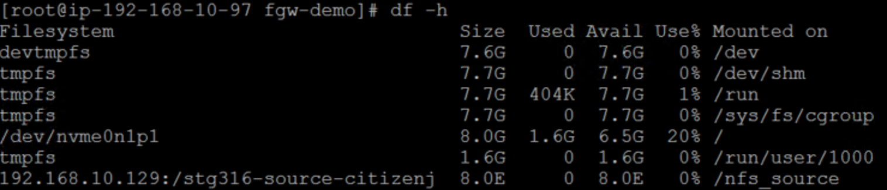

MODULE 2: FILE GATEWAY
==========================
Copyright Amazon Web Services, Inc. and its affiliates. All rights reserved.This sample code is made available under the MIT-0 license. See the LICENSE file.

Errors or corrections? Contact akbariw@amazon.com.

-------------------------------------------------------------------------------

**INTRODUCTION**
-------------------
The AWS Storage Gateway service enables hybrid cloud storage access between an
on-premises environment and AWS. The AWS Storage Gateway in File mode, enables
you to store and retrieve objects in Amazon S3 using file protocols, such as NFS
and SMB. Objects written through file gateway can be directly accessed in your Amazon S3 bucket.

 

**OBJECTIVE**
-------------------

In this module you will perform the following tasks

-   Create an Amazon S3 bucket, to back your File Gateway, file share

-   Deploy an AWS Storage Gateway in File mode

-   Create an NFS file share that is backed by your Amazon S3 bucket

-   Mount the File Gateway, NFS share on a Linux host

-   Transfer 10,000 small files from the local Linux host to the NFS share presented by the File Gateway

-   Verify data transferred to Amazon S3

  

**Lab Diagram: Transferring data to Amazon S3 using File Gateway**
 

  

**CREATE S3 BUCKET - FILE GATEWAY**
---------------------------------------

**Note:** **Ensure that you are logged into your Windows RDP session** and to enter
all required details into the workshop.txt file located on the desktop, as
instructed.

This bucket will be used to back the AWS File Gateway that you will deploy

1.  From the AWS console, click **Services** at the top of the screen and type &
    select **S3**

2.  From the AWS S3 console select **Create bucket**

3.  Provide a unique bucket name for your **Source-S3-bucket**. Use the
    following naming convention “stg316-source-**xyz**” were **xyz** is
    combination your surname and first name (e.g. “**stg316-source-citizenj**”)

    -   Take note of your **Source-S3-bucket** name in your workshop.txt file

4.  Next select **US West (Oregon)** as the region

5.  Click **Next**

6.  Click **Next**

7.  Ensure the “**Block all public access**” check box is enabled, and
    select **Next**

8.  On the final screen, select **Create bucket**

  

**DEPLOY FILE GATEWAY APPLIANCE**
---------------------------------

1.  From the AWS console, at the top of the screen, click **Services** and type
    & select **Storage Gateway**

2.  Click the **Create gateway** button (Appears if it’s the first time you have
    used the service).

    -   Select **Amazon S3 File Gateway** from the list and select **Next**

    -   Select **Amazon EC2** & Click on the **Launch Instance** Icon

    -   On the next screen, select the following values

        -   Select the box next to **c5.2xlarge**

        -   Select **Next: Configure Instance Details**

        -   In the **Network** value select the workshop VPC which has the label
            of “**STG316**”

        -   In the **Subnet** value select the one that has a label of **STG316**

        -   Leave all other values as default

        -   Click **Next: Add Storage**

        -   Click on **Add New Volume** (to add a second volume to the File
            Gateway to use as your cache drive) with the following values

            -   Size : **200GB**

            -   Volume Type : **GP3 - General Purpose SSD (GP3)**

            -   IOPS : **7500**

        -   Click **Next: Add Tags**

        -   Click on **Add Tag**

        -   Enter the following values (case sensitive)

            -   Key = **Name**

            -   Value = **STG316-filegateway**

        -   Click **Next: Configure Security Group**

            -   Click on the **Select an existing security group** check box

            -   Select the security group with the name
                of **STG316-FileGatewaySG**

        -   Click **Review and Launch**

        -   Click **Launch**

        -   Select your **key pair** that you created previously, and
            acknowledge the checkbox and Click **Launch Instances**

3.  From the AWS console, click **Services** and type & select **EC2**

    -   From the left hand EC2 console menu, select **Instances**

        -   In the right hand pane, select the box next to
            **STG316-filegateway**, ensure the **Status Check** column for
            this EC2 instance shows “**2⁄2 checks passed**“ before proceeding to
            the next step (this may take a few minutes)

        -   In the bottom window pane, select the **Details** tab, and take
            note of the **private IPv4** address for the File Gateway instance
            into your workshop.txt file for the value of
            **File-Gateway-Instance-Private-IP=**.

  

**ACTIVATE FILE GATEWAY**
-------------------------

1. From the AWS console, at the top of the screen, click **Services** and type & select **Storage Gateway**

- Click the **Create gateway** button

- Select **Amazon S3 File Gateway** from the list, and select **Next**

- Select **Amazon EC2**, and select **Next**

>   **Do not click on the Launch Instance, you have already done that previously.**

-   Select **Public** for endpoint type, click **Next**

-   Enter the **private IP** address of your File Gateway EC2 instance (value
    of **File-Gateway-Instance-Private-IP**)

-   Select **Next**

-   On the next screen, Leave the time zone unchanged

-   Enter a desired **Gateway name** (i.e. STG316-filegateway)

-   Select **Activate gateway**

-   On the next screen, from the “**Allocated to**” drop down, select “select
    “**Cache**”

-   Click on **Save and continue**. Then on the **Configure logging** page leave the default settings, and Click **Save and continue**

-   Click **Finish**. This will take a few minutes, please wait until see a **Status** of **Running** for your File Gateway before you continue to the next step (you may need to refresh the screen).

  

**CREATE NFS SHARE**
--------------------

In the next steps you will create an NFS file share from your File Gateway.

1.  Following on from the previous steps, you should still be located in
    the **AWS Storage Gateway console**, if not, from the AWS console, at the
    top of the screen, click **Services** and type & select **Storage Gateway**

2.  From the left hand pane of the AWS Storage Gateway console, select **File
    shares**

3.  Select **Create file Share** from the top menu

4.  From the **Gateway** drop down, select the File Gateway instance you just deployed.  Then enter the name of your **Source-S3-bucket** in the **Amazon S3 bucket
    name** field.

5.  Select your region (us-west-2). Leave the **File share name** that is already populated. Select **Network File System (NFS)** for the **Access objects using** field

6.  Leave all other settings as default

7.  Click **Next**

8.  On the next page, leave all the defaults and select **Next**

9.  On the next page, click the **Edit** value next to **Allowed clients**

    -   In the **Access object** section, click on **Add client**. 

    -   Then enter **192.168.0.0/16** in the Allowed clients field

10. From the **Mount options** section, select the following values

    -   Select “**No root squash**” for Squash level

    -   Leave export as **Read-write**

    -   Leave the default values for **File metadata defaults**. Click **Next**

11. Review your inputs and click **Create**

12. On the same File Share page, click on the name of your **File
    share ID**

    -   In the details pane below, copy and paste the **Example command** for mounting **On Linux**
        in to your **workshop.txt** as the value of
        **First-NFS-FileShare-mount-command**\*  you will use this command to mount the NFS share

  

**CONNECT TO THE LINUX HOST**
-------------------------

1.  In your Remote Desktop session, click on Windows icon located at the bottom
    left of the screen

2.  Type CMD and hit Enter to open a new windows command prompt

3.  You should have stored your \*.pem key file on the desktop as per the
    previous instructions. Enter the below commands in the command prompt

		cd c:\users\administrator\desktop

4.  Next you will SSH into the Linux server by entering the below command into your windows command prompt, remember to
    replace the two values shown in **\< \>** with your values 
 
		ssh -i <your-key-file-name>.pem ec2-user@<Linux-Instance-Private-IP>
      
    i.e. ssh –i stg316-key.pem ec2-user\@192.168.10.102

5.  If this is the first time you have connected to this instance, a security
    alert dialog box that asks whether you trust the host to which you are
    connecting.

    -   (Optional) Verify that the fingerprint in the security alert dialog box
        matches the fingerprint that you previously obtained in (Optional) Get
        the Instance Fingerprint
        (<https://docs.aws.amazon.com/AWSEC2/latest/UserGuide/connection-prereqs.html#connection-prereqs-fingerprint>).
        If these fingerprints don’t match, someone might be attempting a
        “man-in-the-middle” attack. If they match, continue to the next step.

        -   Choose **Yes** when you are ready to proceed**.**  
            

    -   A window opens and you are connected to your instance.

  

**MOUNT NFS SHARE**
-------------------

1.  In the open Putty SSH session type the following command

		sudo su

2.  Next, copy the NFS mount command you noted down in your workshop.txt
    for **First-NFS-FileShare-mount-command**, and simply replace
    the **[MountPath]** value at the end of the command with the value
    of “**/nfs_source”** and enter the entire command into the SSH session, and
    hit Enter. it should look similar to the below command except with your values

		mount -t nfs -o nolock,hard 192.168.10.12:/stg316-source-citizenj /nfs_source

3.  Run the below command to verify you have successfully mounted the NFS mount
    point of /**nfs_source** 

		df -h

	

**TRANSFER 10,000 SMALL FILES**
----------------------

Next we are going to copy 10,000 very small files from the local
folder **/workshop_data** to the file gateway NFS share you created & mounted
as **/nfs__source** , using a Linux copy script
 
1.  First lets view the local data we are going to copy by running the following find command, which will return the number of files in the folder
    commands

		cd /workshop_data

		ls -ltr

		find . -type f | wc -l

2.  Run the following commands to start the copy of 10,000 small files (Wait until you get the data transfer completed message before proceeding)

		cd /scripts/fgw-demo

		time ./copy_files_to_nfs.sh

 

	- How long did it take to copy 10,000 small files to the File Gateway's local cache? 
	- The output of the script will return a **real** value, which indicates how how long the copy operation to the file
gateway local cache took

3.  Run the below commands to verify the 10,000 files were copied to the File
    Gateway NFS share

		cd /nfs_source

		ls -ltr

		find . -type f | wc -l

	- How many files does it show that you copied?

2.  Next we are going to change the permissions & ownership of a file which will
    be a reference point in module 3, used to verify metadata being copied
    across. Run the following commands:

		cd /nfs_source/appdata
		
		ls -ltr

		chmod 444 saturn.gif

		chown -R user9:appadmin saturn.gif

		ls -ltr

3.  Lastly, lets verify that the data from the local Linux server has been
    copied through your File Gateway NFS share to your **Source-S3-Bucket** 

    -   Return to your Chrome session and from the AWS console, at the top of
        the screen, click **Services** type & select **S3**

    -   Select your **Source-S3-Bucket** name from the list

    -   Check the box next to **Name** to select all objects

    -   Click on **Actions** → **Get total size**

        -   Note the total object stored in your S3 bucket via File Gateway
        
    -   Click **Cancel** when done viewing.

  

**SUMMARY**
-----------

In this module you have obtained hands on experience on how simple and seamless
it is to leverage a file share presented from the AWS File Gateway as a file transfer mechanism to store data in Amazon S3 (in
this case 10,000 small files). You also gained insight into how the AWS File Gateway can enable
hybrid cloud file storage architectures, where you can access your hot data via
the local file gateway cache, where all your data is backed in an Amazon S3
bucket.

**END OF MODULE 2**
-------------------

Click here to go to [module 3](/module3/README.md)
