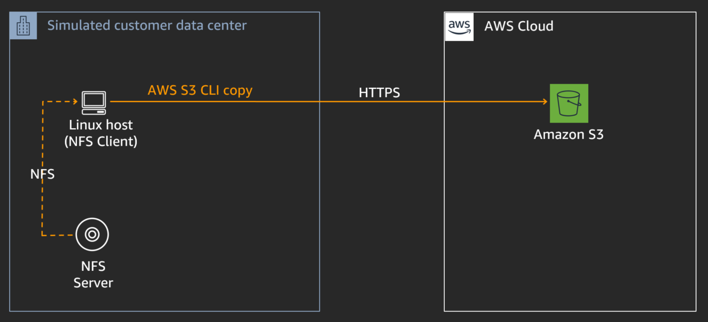
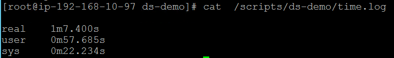
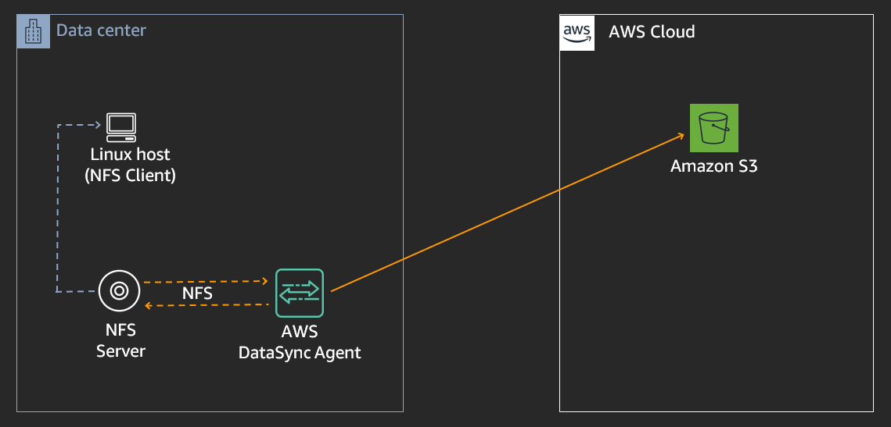
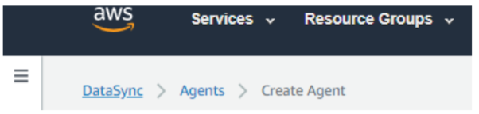
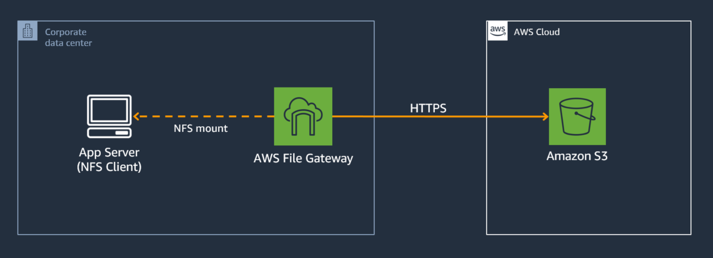
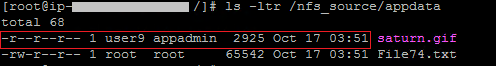

MODULE 3: AWS DATASYNC
======================
Copyright Amazon Web Services, Inc. and its affiliates. All rights reserved.This sample code is made available under the MIT-0 license. See the LICENSE file.

Errors or corrections? Contact akbariw@amazon.com.

-------------------------------------------------------------------------------------
**INTRODUCTION**
-------------------
AWS DataSync is a data transfer service that makes it easy for you to simplify,
automate & accelerate data migration between on-premises storage and Amazon S3
, Amazon Elastic File System , or Amazon FSx for Windows File server. AWS DataSync automatically handles many
of the heavy lifting tasks related to data transfers that can slow down
migrations such as managing scripts, parallel transfers, network optimization, handling encryption,
and data integrity validation.

  

**OVERVIEW**
-------------------
In this module you will transfer approx. 10,000 small files from
an NFS share (**/nfs_source)** to an Amazon S3 bucket using two methods

-   **Method 1 –** Utilize a script which uses the AWS S3 cp command to pull the
    data from an NFS share and push it to an Amazon S3 bucket. We will perform this to get a
    baseline for transfer performance and understand what metadata is copied
    across using this method.

-   **Method 2 -** Deploy and configure a single AWS DataSync agent task to
    accelerate the data transfer bypassing reading the data directly from the NFS server and writing it to an Amazon S3 bucket.
    We will then compare the performance & metadata of both methods.

  

**CREATE S3 BUCKET – AWS DATASYNC**
-----------------------------------

**Note:** This bucket will be used in module 3 as the target for AWS DataSync
transfer

1.  From the AWS console, click **Services** at the top of the screen and type &
    select **S3**

2.  From the AWS S3 console select **+Create bucket**

3.  Provide a unique bucket name for your **Target-S3-bucket**. Use the
    following naming convention “stg316-target-**xyz**” were **xyz** is
    combination your surname and first name (e.g. “**stg316-target-citizenj**”)

    -   Take note of your **Target-S3-bucket** name in your workshop.txt file

4.  Next select **US West (Oregon)** as the region

5.  Click **Next**

6.  Click **Next**

7.  Ensure the **“Block all public access**” check box is enabled, and
    select **Next**

8.  On the final screen, select **Create bucket**

  

 Now let’s configure the IAM role assigned to your Linux EC2 instance, to have full access to the **Target-S3-Bucket** you created

1.	From the AWS console, click **Services** at the top of the screen and type &
    select **IAM**

2.  From left hand menu select **Roles**

3.  In the search field enter the following **S3ROrole**

4.  Click on the returned value  
    

5.  On the next screen click on the Permissions tab and expand the
    **s3ROAccessPolicy located** under the Policy Name

6.  Click on the **Edit Policy**

7.  Click on the **JSON** tab

8.  Replace the contents with the below via copy and paste, and **replace** the  **Target-S3-Bucket** value with your value

		{
		"Version": "2012-10-17",    
		"Statement": [

		{
      		"Effect": "Allow",
     		"Action": "s3:*",
     		"Resource": ["arn:aws:s3:::Target-S3-Bucket/*"]
		}
        
   		 ]
		}

  

- Click on **Review policy** at the bottom of the screen

- Click on **Save changes**

  

**METHOD 1 - 10,000K SMALL FILE MIGRATION USING A SCRIPT**
------------------------------------------------------

1.  Navigate back to your SSH session to your Linux EC2 instance (App Server)

2.  In the SSH session run the below commands to upate the copy script with your
    values as per the instructions shown below

			cd /scripts/ds-demo

			vi copy_script.sh

- Press “**i**” to go into edit mode

- Update the **<Target-S3-Bucket>** in the script with
            the **Target-S3-Bucket** name you created in the previous steps

- Press the “**ESC**” button when you are done editing

- Type ”:**wq**” and hit **Enter** to save changes and exit

3.  Now let’s open a second SSH session using the below steps (which we will use
    to monitor the network performance), leave this session open

    -   In your remote desktop session, click on Windows icon located at the
        bottom left of the screen

    -   Type **CMD** and hit Enter to open a new command prompt

    -   You should have stored your ***.pem** key file on the desktop as per the
        previous instructions. 

	- Enter the below commands in the command prompt

			cd c:\users\administrator\desktop

    -  Next enter the below command to SSH into the Linux server, remember to replace the two values shown in **< >** with your values (*i.e. ssh –i stg316-key.pem ec2-user@192.168.10.102*)

			ssh -i <your-key-file-name>.pem ec2-user@<Linux-Instance-Private-IP>  

    - Switch back to your **first** SSH session and run the below commands to start
    the script to copy data from **/nfs_source** to your **Target-S3-Bucket**

			cd /scripts/ds-demo

			./start-transfer.sh

    - Switch to your **second** Putty SSH session which you just opened and run the
    following command to observe the copy transfer performance

			sudo su

			cd /scripts/ds-demo

			./show_performance.sh
  

**Note** the throughput values shown (i.e. x MB/s transfer rate) for the first 30 seconds, then switch back to your first SSH session window

- Navigate back to the first SSH session and wait until the output states “**Data transfer to Amazon S3 bucket complete”**

- From within your first SSH session run the following commands

			cat /scripts/ds-demo/time.log

**Take note** of the time the script took to run (it is the time value shown next to the value for **real**)

  

**METHOD 2 - 10K SMALL FILE MIGRATION USING AWS DATASYNC**
----------------------------------------------------------

  

**DEPLOY AWS DATASYNC AGENT**
-----------------------------

We are going to deploy the AWS DataSync agent within AWS as an EC2 instance in
the absence of an on-premise environment (where you could deploy it as a VMware
appliance). The AWS DataSync agent will then read directly from the NFS server
(not the NFS client) and transfer the data to your **Target-S3-Bucket**

1.  Using the Chrome icon on the Windows EC2 instance desktop, log into your AWS Account using Chrome

2.  From the chrome session, in the AWS console, at the top of the screen, click **Services** and type & select **DataSync**

    -   Select **Get Started**

    -   In the Create agent page, under the **Amazon EC2** section click on
        the **Learn more**  icon

    -   Scroll down to the table that has a list of **AMI Names**, and click on
        the **Launch Instance** link corresponding to the **us-west-2** Oregon
        row

        -   In the next page, select the box next to **m5.xlarge**

        -   Select **Next: Configure Instance Details**

        -   In the **Network** drop down select the VPC which has “**STG316**”
            in its name

        -   In the **Subnet** drop down, select the one which has “**STG316**”
            in its name

        -   Leave all other settings as default on the page

        -   Click **Next: Add Storage**

        -   Click **Next: Add Tags**

            -   Select **Add Tag**

        -   Enter the following values (case sensitive)

            -   Key = **Name**

            -   Value = **STG316-DataSync**

        -   Click **Next: Configure Security Group**

            -   Click on the “**Select an existing security group**” check box

            -   Select the security group with the name
                of **STG316-FileGatewaySG**

        -   Click **Review and Launch**

        -   Click **Launch**

        -   Select your **key pair** , accept the check box and click **Launch
            Instances**  
            

    -   From the AWS console, click **Services** and type & select **EC2**

        -   From the left hand menu, select **Instances**

        -   In the right hand pane, select the box next to “**STG316-DataSync**”

        -   From the bottom window pane, select the **Description** tab, and
            take note of the **private IP** address into your workshop.txt file
            for **DataSync-Instance-Private-IP**

            -   Ensure the “**Status Check**” column for this EC2 instance
                shows **“2/2 checks passed“** before proceeding to the next
                step.

        -   From the AWS console, at the top of the screen,
            click **Services** and type & select **DataSync**

            -   Select **Get Started**

            -   Enter the following values on the page

                -   **Service endpoint:** Select Public service endpoints in US
                    West (Oregon)

                -   **Activation key:** Enter the Private IP address you noted
                    down in the previous step for **DataSync-Instance-Private-IP**

                -   Select **Get Key**

                    -   You will get the following successful output after your
                        agent has activated successfully

                -   Select **Create Agent** to continue

		

	-   When the create agent process is complete click on the **blue DataSync**
  	  link at the top left of the screen to continue with the next step of
  	  creating a task

	

  

**TRANSFER DATA USING DATASYNC** 
---------------------------------

1.  Click on the **Create task** from the top right hand side of the window

    -   Select **Create a new location** from the source locations options

    -   **Location type:** Network File System (NFS)

    -   **Agents:** select the agent you have just deployed

    -   **NFS Server:** enter the value of
        your **File-Gateway-Instance-Private-IP**

    -   **Mount path:**  enter your **Source-S3-Bucket** name value

    -   Click **Next** to continue

2.  Select **Create a new location** from the Destination locations options

    -   **Location type:** Amazon S3 bucket

    -   **S3 bucket:** **Target-S3-Bucket**

    -   **S3 storage class:** select Standard

    -   **Folder:** Type“**datasync-copy**“

    -   **IAM role:**: click on the **Autogenerate** button

    -   Click **Next** to continue

3.  Provide a task name (*i.e. NFS-to-S3-transfer-10K-small-files*)

    -   **Verify data:** Check integrity during transfer

    -   **Copy file metadata:** Ensure the following items are all checked

        -   Copy ownership

        -   Copy permissions

        -   Copy time stamps

    -   Leave all other options as such as default & select **Next**

    -   Click **Create task**

4.  On the next screen wait until the **Task status** value is **Available**
    (refresh screen to get update)

5.  Click on the **Start** button

6.  Leave all options as they are (don’t override any) and click on **Start**

7.  At the top of the screen click on the **See execution details** button to
    view the progress of the transfer

8.  The task will go through a few phases, where it will first compare the files
    in the source location with what’s stored on the target before sending the new or updated files. In this lab there
    are approx 10,000 files to be transferred so the launching phase may take a
    moment or two before switching to the transferring state.

    -   While it is going through these states, navigate through the
        performance, locations, options, filters and task logging tabs in the
        middle of the screen to verify the parameters you have configured and
        the view the outputs available

9.  When the **Execution status** show a status of **Success**, your data
    transfer has completed.

    -   Take note of the **Duration** time taken for the data transfer, and also
        of the **Data throughput** values, how do they compare with the values
        you achieved using the S3 copy script in the previous section?

  

**VERIFY DATA TRANSFERRED USING BOTH METHODS**
----------------------------------------------

1.  From the AWS console, click *Services* at the top of the screen type &
    select *S3*

-   Click your **Target-S3-bucket** name

    -   Check the box next to the folder labelled **s3-cli-copy**

        -   Click on **Actions**→ **Get total size**

        -   Note the total objects copied to your S3 bucket via the S3 copy
            script

        -   Click **Cancel** when done viewing.

    -   Check the box next to the folder labelled **datasync-copy**

        -   Click on **Actions**→ **Get total size**

        -   Note the total objects copied to your S3 bucket via DataSync

        -   Click **Cancel** when done viewing.

-   Click on the folder name **datasync-copy** to go into the directory/prefix

    -   Click on **Appdata**

    -   Click on the box to the left of **saturn.gif**

    -   From the right hand pop-up window, under the properties section click
        on **Metadata**

    -   This will show you the metadata that DataSync added to object that it
        copied across to S3. In the next section we view the value of this
        metadata to help avoid re-factoring applications that access files based
        on user/group permissions.

-   Click **Cancel** to continue

  

**COMPARE METADATA: SCRIPT VS DATASYNC**  
------------------------------------------------

 

Now let’s create a File Gateway NFS share and point it to the Amazon S3 bucket
that we just transferred data to, using the two methods, to compare metadata
details.

  

**Create NFS Share**

1.  From the AWS console, at the top of the screen, click **Services** and type
    & select **Storage Gateway**

2.  On the left hand pane of the AWS Storage Gateway console, select **File
    shares**

3.  Select **Create file Share** from the top menu

4.  Enter the name of your **Target-S3-bucket** in the **Amazon S3 bucket
    name** field.

5.  Select **Network File System (NFS)**

6.  Select the **File Gateway** you just deployed (STG316-filegateway)

7.  Click **Next**

8.  Leave all defaults and select **Next**

9.  On the next page, click the **Edit** value next to **Allowed clients**

    -   Remove the existing **0.0.0.0/0** value and replace it
        with **192.168.0.0/16**

    -   Then click the **Close** button to the on the right of the screen for
        Allowed clients

10. Click the **Edit** value next to **Mount options**

    -   Select “**No root squash**” for Squash level

    -   Leave export as **read-write**

    -   Then click the **Close** button to the on the right of the screen for
        Mount options

11. Scroll to the bottom of the page and click **Create file share**

12. You will be taken to the **File share** page. Click on the **refresh
    Icon** on the top right hand corner, until the status of the file share
    changes from **Creating** to **Available**, before proceeding to the next
    steps.

13. On the same File Share page, check the box next to the name of your **File
    share ID**

14. In the details pane below, copy the command for mounting **On Linux** in
    to your **workshop.txt** for the value of
    **Second-NFS-FileShare-mount-command**

  

**Mount NFS Share**

1.  Navigate back to your SSH session run the following command

		sudo su

2.  Next, copy the NFS mount command you noted down in your workshop.txt
    for **Second-NFS-FileShare-mount-command**, and simply replace
    the **[MountPath]** value at the end with the value of
     **/nfs_target** and enter the entire command into the SSH session, and
    hit Enter

    -   *i.e. mount -t nfs -o nolock,hard 192.168.10.12:/stg316-target-citizenj
        /nfs_target*

3.  Run the below command to verify you have the NFS mount points of
    **/nfs_target** showing in the list

		df -h

  

**COMPARE TRANSFER METHODS: SCRIPT VS DATASYNC**

Now let’s view the files that the S3 copy script & DataSync agent copied across
from a file share point of view to see how the metadata translates to the stored
files, and what attributes were preserved

1.  From the AWS console, at the top of the screen, click **Services** and type
    & select **Storage Gateway**

    -   From the left hand pane select **File shares**

    -   Check the box next to the file share ID which shows
        your **Target-S3-Bucket** name in the S3 Bucket column

    -   From the top menu select **Action**→ **Refresh Cache** then
        select **Start**

2.   **View original data**- Run the below command in your Putty SSH session
        to view the original data time stamp & permissions for the
        file **saturn.gif** located on /nfs_source

			ls -ltr /nfs_source/appdata

3.    **View S3 copy script data that was transferred** - Run the below
        command to view the time-stamp, user/group & permission attributes for
        the file **saturn.gif** copied via the S3 CLI copy script.

			ls -ltr /nfs_target/s3-cli-copy/appdata

-   Do the time-stamps, user/group & permission value differ from the original data?

4.   **View DataSync copied data** - Run the below command to view the
        timestamp, user/group & permission value for the
        file **saturn.gif** copied via DataSync.

			ls -ltr /nfs_target/datasync-copy/appdata   

-   Do the time-stamps, user/group & permission value differ from the
        original data? Were they preserved?
  

**Note:** Notice how the Saturn.gif file that was copied across using DataSync
retained the same timestamp & permissions (r-r-r & user9:appadmin) as the
original source file, unlike the data copied across via the script.

  

**SUMMARY**
-----------

In module 3, you obtained hands-on experience in deploying and configuring AWS
DataSync to simplify, automate and accelerate the transfer of data, in this case
10,000 very small files to Amazon S3 compared to scripting it. AWS DataSync also
copied across the metadata (so you could re-access the same objects again via
File Gateway as files with their permissions & timestamps). AWS DataSync
encompassed data transfer verification, and didn’t require any scripting
knowledge or performance tuning to enable faster data transfers.

  

**END OF MODULE 3**
-------------------

Click here to go to [module 4](/module4/README.md)

