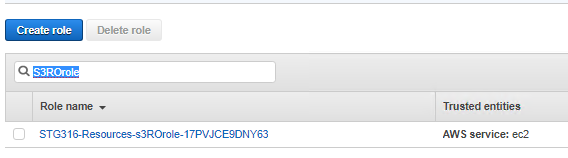

AWS TRANSFER FOR SFTP MODULE- FILE TRANSFER PROTOCOL DATA
=========================================================
Copyright Amazon Web Services, Inc. and its affiliates. All rights reserved.This sample code is made available under the MIT-0 license. See the LICENSE file.

Errors or corrections? Contact akbariw@amazon.com.

-------------------------------------------------------------------------

**INTRODUCTION**
----------------
AWS Transfer for SFTP provides a highly available and scalable SFTP service which can be
used by users and applications as a very easy mechanism to move data both for
migration, integration or just ad-hoc use cases. 

  

**OBJECTIVE**
----------------
This module will show how AWS
Transfer for SFTP can be setup to move data in to or out of Amazon S3 and we’ll
show how the same data can then be accessed through the Storage Gateway that you
setup in Module 2.

  

**CREATE TARGET S3 BUCKET AND PERMISSIONS**
-----------------------------------

**Note:** This bucket will be used as the target S3 bucket by different AWS services in the workshop modules.

1.  From the AWS console, click **Services** at the top of the screen and type &
    select **S3**

2.  From the AWS S3 console select **Create bucket**

3.  Provide a unique bucket name for your **Target-S3-bucket**. Use the
    following naming convention “stg316-target-**xyz**” were **xyz** is
    combination your surname and first name (e.g. “**stg316-target-citizenj**”)

    -   Take note of your **Target-S3-bucket** name in your workshop.txt file

4.  Next select **US West (Oregon)** as the region

5.  Click **Next**

6.  Click **Next**

7.  Ensure the **“Block all public access**” check box is enabled, and
    select **Next**

8.  On the final screen, select **Create bucket**

  

 Now let’s configure the IAM role assigned to your Linux EC2 instance so it has full access to the **Target-S3-Bucket** you created

1.	From the AWS console, click **Services** at the top of the screen and type &
    select **IAM**

2.  From left hand menu select **Roles**

3.  In the search field enter the following **S3ROrole**

4.  Click on the returned value  
    

5.  On the next screen click on the Permissions tab and expand the
    **s3ROAccessPolicy located** under the Policy Name

6.  Click on the **Edit Policy**

7.  Click on the **JSON** tab

8.  Replace the contents with the below via copy and paste, and **replace** the  **Target-S3-Bucket** value with your value

		{
		"Version": "2012-10-17",    
		"Statement": [

		{
      		"Effect": "Allow",
     		"Action": "s3:*",
     		"Resource": ["arn:aws:s3:::Target-S3-Bucket/*"]
		}
        
   		 ]
		}

  

- Click on **Review policy** at the bottom of the screen

- Click on **Save changes**

  

  

  

**CREATE USER FOLDERS IN S3 BUCKET FOR AWS TRANSFER FOR SFTP**
-----------------------------------

The AWS Transfer for SFTP service stores data in S3 bucket. We will be working with the **Target-S3-Bucket** you created earlier and noted in your workpad.txt
file:

1.  From the AWS console, at the top of the screen, click **Services** and type & select **S3**

2.  Find your bucket in the list (**Target-S3-Bucket**) and click on it

Add some user folders to your bucket for us to use later:

1.  Click the **Create Folder** button

2.  Provide the folder name **jess**

3.  Click **Save**

4.  Click the **Create Folder** button

5.  Provide the folder name **charlie**

6.  Click **Save**

At the end of this task you should now have:  
• Created an S3 bucket that AWS Transfer for SFTP can use to store your data  
• Added some folders to your S3 bucket to use as your users home destinations

  

**SETUP IAM POLICY AND ROLES**
-------------------

AWS Transfer for SFTP will be working with objects in S3 on behalf of your SFTP
users. We need to create IAM roles that will define the permissions we want our
SFTP users to have. This role will later be mapped onto our SFTP users when we
create them *Note: the user will have access to all buckets that the attached
IAM role grants them access to*

1.  From the AWS console, at the top of the screen, click **Services** and type & select **IAM**

2.  Click on **Policies** & then **Create Policy** 

- Click on the **JSON tab**
- Replace the contents with the below via copy and paste, and replace the **Target-S3-Bucket** value with your value
		
 

	{
	"Version": "2012-10-17",    
	"Statement": [

	{
      	"Effect": "Allow",
     	"Action": "s3:*",
     	"Resource": ["arn:aws:s3:::Target-S3-Bucket", "arn:aws:s3:::Target-S3-Bucket/*"]
	}
        ]
	}

 
	
- Click **Next:Tags** then **Next:Review**
- Provide the policy with a name such as **target-s3bucket-rw-policy**
- Click on **Create policy**
	

3.  From the left hand pane click on **Roles** and then click **Create Role**

4.  We need to allow Transfer to assume the role we create. From the list of AWS services shown, click on **Transfer**. (This creates a trust
    relationship for the role)

5.  Click **Next: Permissions**

We now need to decide what permissions we would like to give our SFTP user to
access S3. We will use the policy we created in the previous step to only allow read/write access to your target Amazon S3 bucket

6.  In the search field enter the policy name you created earlier and select it (i.e. **target-s3bucket-rw-policy**)

7.  Click **Next: Tags** and **Next: Review**

8.  Provide a **Role Name** (e.g. myAWSTransferUserRole)

9.  Click **Create Role**

 

> We now need to create a second role which will be used by AWS SFTP to send its logs to Cloud
Watch Logs.

1.   From the AWS console, at the top of the screen, click **Services** and type & select **IAM**

2.  Click on **Roles**

3.  Click **Create Role**

4.  We need to allow Transfer to assume the role we create. From the list of AWS services shown, click on **Transfer** This creates a trust
    relationship for the role

5.  Click **Next: Permissions**

6.  Filter the policies by entering AWSTransfer

7.  Tick the box next to **AWSTransferLoggingAccess** This is an AWS Managed
    policy that will allow access to CloudWatch Logs

8.  Click **Next: Tags** and **Next: Review**

9.  Provide a **Role Name** (e.g. myAWSTransferLogRole)

10. Click **Create Role**

At the end of this task you should now have:  
• Created and IAM role with trust policy and S3 access  
• Created a logging role

  

**CREATE AWS TRANSFER FOR SFTP INSTANCE**
-----------------------------------------

In order to enable SFTP for our users we need to create our AWS Transfer for
SFTP server

1.  From the AWS console, at the top of the screen, click **Services** and type & select **AWS Transfer family**

2.  Make sure your Region is set to: **us-west-2 Oregon**

3.  Click **Create Server**

4.  Select **SFTP** as your protocol, click **NEXT**

5.  Select **Service Managed** click **Next**. On the next screen, select **Publically accessible** as your endpoint type, and click on **NEXT**

6.  Select **Amazon S3** for the domain type and click **Next**

7.  In the CloudWatch logging section Click on **Choose an existing IAM role**, then select the role you created or CloudWatch logging (i.e. myAWSTransferLogRole) and click **Next** then **Create Server** to finish

8.  Your server will be created and show as starting. When the server is ready
    for use the status will change to **Online** (this will take a few minutes)

9.  Click on the **Server ID** of the the AWS Transfer for SFTP instance

10. Take note of the endpoint address shown for your **server-id** for later in your workshop
    file as **Transfer-For-SFTP-Endpoint-IP-Address** (e.g.
    s-1234567890123.server.transfer.ap-us-west-2.amazonaws.com) 

At the end of this task you should now have:

• Created your AWS Transfer for SFTP endopoint & noted down the name of your AWS Transfer for SFTP server endpoint

  

**CONNECT TO LINUX CLIENT AND SFTP SESSION**
----------------

In the following steps, we will use the linux instance provided for this workshop, and its SFTP client for the SFTP tasks

 

1.  In your Remote Desktop session, click on Windows icon located at the bottom
    left of the screen

2.  Type CMD and hit Enter to open a new command prompt

3.  You should have stored your \*.pem key file on the desktop as per the
    previous instructions. Enter the below commands in the command prompt

		cd c:\users\administrator\desktop

4.  Next enter the below command to SSH into the Linux server, remember to
    replace the two values shown in **\< \>** with your values
    
    		ssh -i <your-key-file-name>.pem ec2-user@<Linux-Instance-Private-IP> 
      
    i.e. ssh –i stg316-key.pem ec2-user\@192.168.10.102

5.  If this is the first time you have connected to this instance, a security
    alert dialog box that asks whether you trust the host to which you are
    connecting.

    -   (Optional) Verify that the fingerprint in the security alert dialog box
        matches the fingerprint that you previously obtained in (Optional) Get
        the Instance Fingerprint
        (<https://docs.aws.amazon.com/AWSEC2/latest/UserGuide/connection-prereqs.html#connection-prereqs-fingerprint>).
        If these fingerprints don’t match, someone might be attempting a
        “man-in-the-middle” attack. If they match, continue to the next step.

        -   Choose **Yes** when you are ready to proceed**.**  
            

    -   A window opens and you are connected to your instance.

  

AWS Transfer for SFTP provides inbuilt user management for users to authenticate
via SSH key pairs. Lets setup an SSH key pair that we will use to test
authentication for our users. Run this command in your SSH terminal

    cd ~
    
    ssh-keygen -P "" -f myAWSTransferSSHKey
    
    chmod 400 myAWSTransferSSHKey

  

**CREATE SFTP USERS & TRANSFER DATA**
-------------------------------------

We now need to create SFTP users that will be allowed to log into the SFTP
service and access files in S3. When we create the user we have to attach an IAM
role that defines what data the user will be able to access in S3 (we defined
this role and policy in the previous steps as - myAWSTransferUserRole)

AWS Transfer is responsible for authenticating the user based on their SSH key
and then authorises them based on the attached IAM Role and policy

1.  From the AWS console, at the top of the screen, click **Services** and type & select **AWS Transfer Family**

2.  Click on the SFTP server that you created

3.  Under Users Click on **Add User**

4.  Use the username **jess**

5.  Under **Access** chose the IAM access role that you created in the previous steps to provide
    the access policy to your underlying Amazon S3 bucket (e.g. myAWSTransferUserRole)

6.  Under **HomeDirectory** select your **Target-S3-Bucket**

7.  Under **SSH public keys** you need to copy in the public part of your ssh
    key that you created in the first part of this module

    -   In your Linux instance SSH session, run the below command 
    				
			cat myAWSTransferSSHKey.pub

    -   Copy the output and paste it into the **SSH public keys** field in the AWS Transfer family console

8.  Click **Add**

Now that you have a SFTP server and an SFTP user, you can try logging in:

1.  Run the following command to connect to the AWS Transfer for SFTP endpoint, substituting with your AWS Transfer for SFTP endpoint (from prevoius step) 
    
    		sftp -i ./myAWSTransferSSHKey   jess@<AWS-Transfer-for-SFTP-full-endpoint>

>   Note: you need to run this command in the directory where your ssh key is stored

1.  You are now in the SFTP shell and mapped to the S3 bucket. You can navigate
    this S3 bucket using ls, and also use pwd, and also cd \<folder\> operations. Notice how the access
    level to bucket data is dependent on the user’s mapped IAM role

2.  You can attach the same IAM role to multiple users as required (or use
    different ones for different access requirments) by reperating the previous steps

3.  Exit out of the SFTP client back to the linux host by tying the exit command

4.  Create a couple of files in the local linux directory:

		cd ~

		touch file1.txt

		touch file2.txt

5.  Upload these new files:

    -   Run the following command to connect to the AWS Transfer for SFTP endpoint, substituting with your AWS Transfer for SFTP endpoint  
	
			sftp -i ./myAWSTransferSSHKey jess@<AWS-Transfer-for-SFTP-full-endpoint>

    -   change directory to one of your user folders by running "cd
        directoryname" (e.g. cd jess)

    -   Upload your files with the following command

			put file1.txt ./

			put file2.txt ./

6.  Close the SFTP connection with the exit command

7.  You can view the AWS Transfer logs in the CloudWatch Logs Console

    -   Navigate back to the Transfer
        console <https://console.aws.amazon.com/transfer/home>

    -   Click on the SFTP server that you created

    -   Click on the View Logs button

    -   Click to open one of the log streams for your user to view transfer
        activity

At the end of this task you should now have:  
• Created one or more SFTP users  
• Logged in using their mapped SSH key  
• Checked you can only access the S3 data that you expected

  

**ACCESS YOUR DATA THROUGH THE S3 FILE GATEWAY**
-----------------------------------------

 

We’re now going to show you how the files you uploaded via SFTP to your S3 bucket in this module, are accessible
to other users and applications through alternative access mechanisms. In this case the S3 File Gateway we
created in the earlier module

Firstly let’s create a File Gateway NFS share and point it to the target S3 bucket that our SFTP users uploaded the data to.
This will help you easily access and manage the data from the view of a file share.

  

**Create NFS Share**

1.  From the AWS console, at the top of the screen, click **Services** and type
    & select **Storage Gateway**

2.  On the left hand pane of the AWS Storage Gateway console, select **File
    shares**

3.  Select **Create file Share** from the top menu

4.  Select your gateway from the **Gateway** drop down (i.e. STG316-filegateway)

5.  Then enter the name of your **Target-S3-bucket** in the **Amazon S3 bucket
    name** field (i.e. stg316-target-citizenj). Leave the default file share name provided

6.  In the Access objects using section, select **Network File System (NFS)**

7.  Click **Next**

8.  Leave all defaults and select **Next**

9.  On the Access object section, click on **Add clients**

    -   Enter this value in the field allowed clients field **192.168.0.0/16**

    
10. In the Mount options section

    -   Select “**No root squash**” for Squash level

    -   Export as **Read-write**

    -   Leave all other items as default and click the **Next**

11. Scroll to the bottom of the page and click **Create**

12. You will be taken to the **File share** page. Click on the **refresh
    Icon** on the top right hand corner, until the status of the file share
    changes to **Available**, before proceeding to the next
    steps.

13. On the same File Share page, check the box next to the name of your **File
    share ID**

14. In the details pane below, copy the command for mounting **On Linux** in
    to your **workshop.txt** for the value of
    **Second-NFS-FileShare-mount-command**

  

**Mount NFS Share**

1.  Navigate back to your SSH session and run the following command

		sudo su

2.  Next, copy the NFS mount command you noted down from the previous step into your workshop.txt
    for **Second-NFS-FileShare-mount-command**. Simply replace
    the **[MountPath]** value at the end with the value of
     **/nfs_target** and enter the entire command into the SSH session, and
    hit Enter

    -   *i.e. mount -t nfs -o nolock,hard 192.168.10.12:/stg316-target-citizenj
        /nfs_target*

3.  Run the below command to verify you have the NFS mount points of
    **/nfs_target** showing in the list

		df -h

  

  

Let's use the S3 File Gateway and its NFS share to access our data stored in our S3 bucket 

1.  From your SSH session run the following command to change into your NFS mount directory for the **Target-S3-Bucket**

		cd /nfs_target

2.  Check that your updated files from SFTP are not currently visible. This is
    because the cache in the Storage Gateway has not been told about changes to
    the backend S3 bucket

		ls

3.  Navigate to the Storage Gateway AWS console and select **File Shares** from the
    left hand windows

    -   Select the file share the corresponds with your **Target-S3-Bucket**

    -   Click **Action** → **Refresh Cache**

    -   Click **Start**

    -   Wait a minute then continue to the next step

4.  Have another look at the local file system mount and see if your new files
    are available, by running the following commands in your SSH session, where you replace username with the username you created e.g. jess

		cd /nfs_target

		ls

		cd username 

		ls

    -   you should see your new file1.txt and file2.txt files through the NFS file share
        mount point you just created

  

**SUMMARY**
-----------

In this module, you obtained hands-on experience in deploying & configuring AWS
Transfer for SFTP, and also transferring files using SFTP commands. 
You also learned how to seamlessly access the data stored in Amazon S3
by AWS Transfer for SFTP service through the use of the AWS File Gateway.

  

**END OF MODULE**
-------------------

CLICK [here to go to the AMAZON KINESIS DATA FIREHOSE module](/kinesis/README.md)
-------------------

